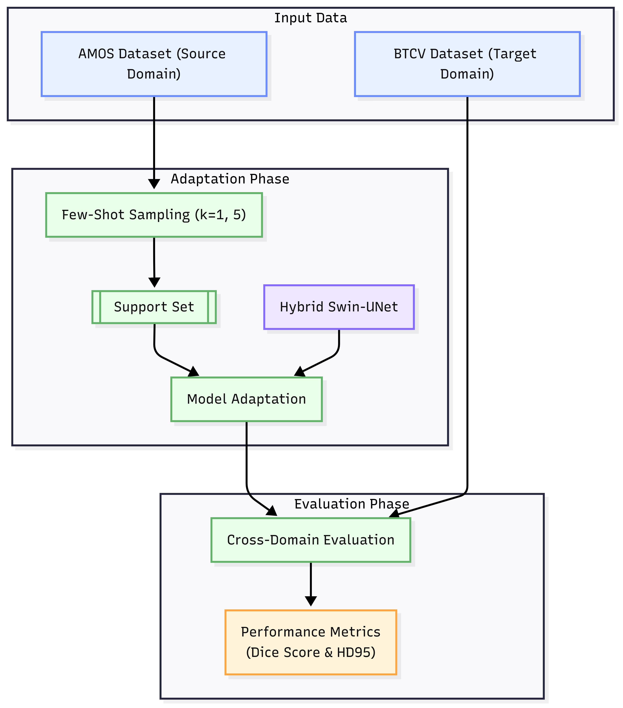
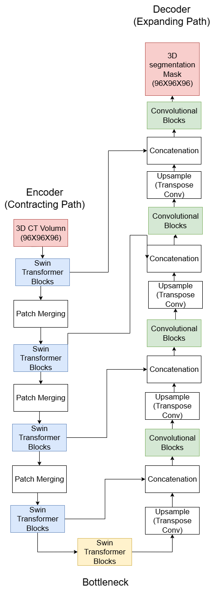

# Few-Shot Cross-Domain 3D Abdominal Multi-Organ Segmentation using Hybrid Swin-UNet

[](https://pytorch.org/)
[](LICENSE)
[-darkgreen.svg)](https://www.sciencedirect.com/journal/computers-in-biology-and-medicine)

---

## 1. Overview

This repository contains the modular PyTorch implementation of **Hybrid Swin-UNet** for few-shot cross-domain 3D abdominal multi-organ segmentation from CT scans.

The model is adapted using small $k$-shot support subsets ($k \in \{1, 3, 5, 10\}$) from the **AMOS 2022** dataset (Source Domain) and evaluated directly on the unseen **BTCV** dataset (Target Domain) across **13 standardized overlapping abdominal organs**.



---

## 2. Repository Structure

The codebase is organized into modular categories:

```
Hybrid_Swin_UNet/
├── AGENTS.md                  # Reviewer directives, research audit & journal submission protocol
├── README.md                  # Project overview, directory layout & reproduction guide
├── requirements.txt           # Python package dependencies
├── .gitignore                 # Standard Python/PyTorch ignore rules
├── train.py                   # Top-level CLI execution entrypoint
│
├── figures/                   # Architectural & qualitative figures
│   ├── fig1_workflow.png      # Few-shot cross-domain workflow diagram
│   ├── fig2_architecture.png  # Hybrid Swin-UNet model architecture schematic
│   └── fig3_qualitative.png   # Qualitative visual slice comparison
│
├── manuscript/                # Scientific manuscripts & conference drafts
│   └── Hybrid_Swin_UNet.md    # ICCIT 2025 paper draft (upgrading to CBM journal)
│
├── src/                       # Core modular package
│   ├── __init__.py
│   ├── data/                  # Data ingestion & harmonization
│   │   ├── __init__.py
│   │   ├── data_loader.py     # On-demand HF streaming, resampling & 96^3 cropping
│   │   └── label_mapping.py   # AMOS (15 classes) -> BTCV (13 classes) harmonizer
│   │
│   ├── models/                # Deep learning neural network architectures
│   │   ├── __init__.py
│   │   ├── hybrid_swin_unet.py# 3D Hybrid Swin-UNet (3D Swin encoder + 3D CNN decoder)
│   │   └── unet3d.py          # Standard 3D Convolutional U-Net baseline
│   │
│   └── utils/                 # Mathematical losses & clinical metrics
│       ├── __init__.py
│       ├── losses.py          # Compound 3D Dice + Cross-Entropy loss
│       └── metrics.py         # Multi-class DSC (%), HD95 (mm), ASD (mm), Gen. Gap
│
└── scripts/                   # Standalone execution pipelines
    ├── train_fewshot.py       # Episodic few-shot training & evaluation runner
    └── cleanup_checkpoints.py # Hugging Face Cloud & local storage optimizer
```

---

## 3. Standardized 13-Organ Anatomical Taxonomy

To resolve cross-dataset label discrepancies between AMOS 2022 (15 classes) and BTCV (13 classes), all label masks are harmonized into a standardized 14-class index space ($0$: Background, $1$–$13$: Organs):

| Unified Index | Anatomical Organ | Raw AMOS Index | Raw BTCV Index | Harmonization Action |
| :---: | :--- | :---: | :---: | :--- |
| **0** | **Background** | 0 | 0 | Preserved |
| **1** | **Spleen** | 1 | 1 | Direct Match |
| **2** | **Right Kidney** | 2 | 2 | Direct Match |
| **3** | **Left Kidney** | 3 | 3 | Direct Match |
| **4** | **Gallbladder** | 4 | 4 | Direct Match |
| **5** | **Esophagus** | 5 | 5 | Direct Match |
| **6** | **Liver** | 6 | 6 | Direct Match |
| **7** | **Stomach** | 7 | 7 | Direct Match |
| **8** | **Aorta** | 8 | 8 | Direct Match |
| **9** | **Inferior Vena Cava (IVC)** | 9 | 9 | Direct Match |
| **10** | **Portal & Splenic Vein** | — | 10 | Direct Match (BTCV) |
| **11** | **Pancreas** | **10** ⚠️ | **11** | **Remapped (AMOS $10 \rightarrow 11$)** |
| **12** | **Right Adrenal Gland** | **11** ⚠️ | **12** | **Remapped (AMOS $11 \rightarrow 12$)** |
| **13** | **Left Adrenal Gland** | **12** ⚠️ | **13** | **Remapped (AMOS $12 \rightarrow 13$)** |

---

## 4. Architecture Specifications



- **Hierarchical 3D Swin Encoder:** Alternating 3D Window Attention (W-MSA) and Shifted Window Attention (SW-MSA) with relative positional bias and linear complexity $\mathcal{O}(N \cdot M^3)$.
- **Patch Embedding:** $2 \times 2 \times 2$ cubic patch projection producing 4 multi-scale stages.
- **3D Convolutional U-Net Decoder:** Trilinear upsampling with InstanceNorm + GeLU convolutions.
- **Model Efficiency:** Proposed Hybrid Swin-UNet has **2.78 M parameters** (~4.5× more compact than standard 12.70 M 3D U-Net).

---

## 5. Quickstart & Execution

### Installation
```bash
pip install -r requirements.txt
```

### Running Few-Shot Adaptation & Benchmark
To run few-shot cross-domain adaptation:
```bash
# 5-shot adaptation with Hybrid Swin-UNet
python train.py --model hybrid_swin --shots 5 --epochs 50 --eval_cases 30

# Benchmark comparison with 3D U-Net baseline
python train.py --model unet3d --shots 5 --epochs 50 --eval_cases 30
```
